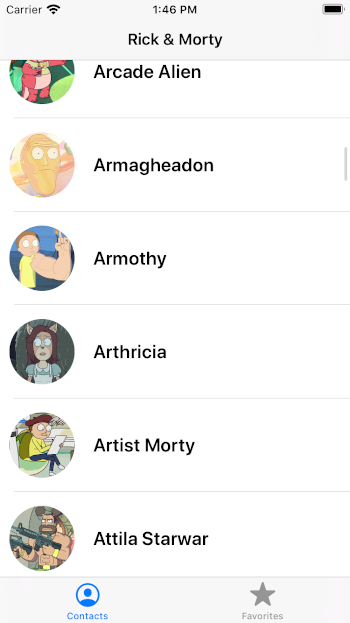
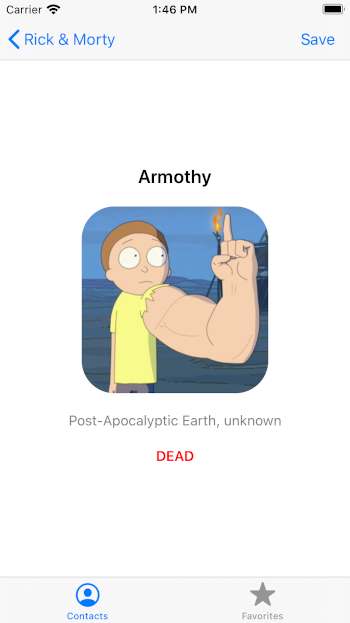
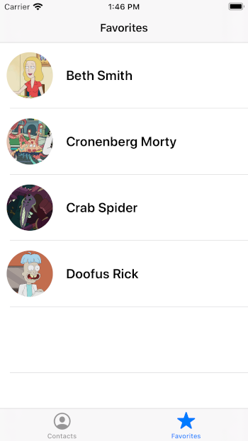

# Rick&amp;Morty iOS
Sample VIPER Architecture in iOS

* CoreData
* CoreLocation
* Notification
* Alamofire
* RxSwift

## Features

* List character from API (Paging)
* Add/Modify/Remove favorite Characters
* Save current location when character is added to favorite
* Region monitorized (enter/exit) when character is added to favorite
* Show notification when enter/exit from region where character favorited was added

<!---   -->
<!---   -->
